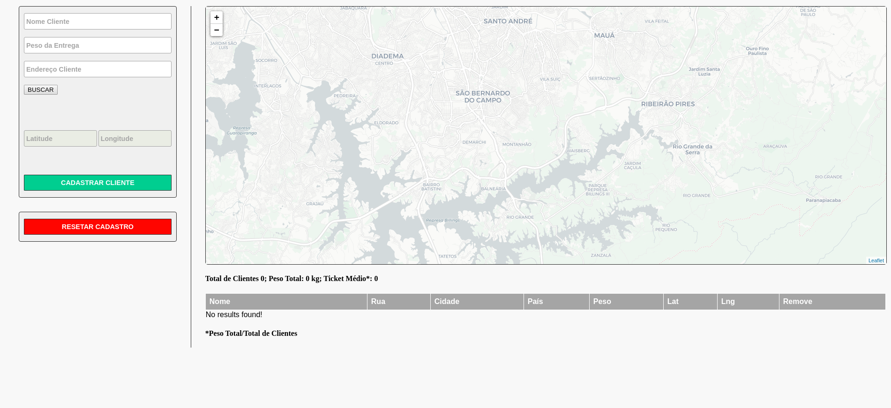

# Teste Front-End ROUTEASY
Teste técnico da RoutEasy, desenvolvido com reactjs.

## Como usar

1. clone o repositório: git@github.com:alexandrejuk/Payment-Service-Provider.git
2. cd routeasy-frontend
3. npm install
4. npm test (para executar os testes)
5. npm run storybook (para executar o storybook)
6. npm start (para iniciar a aplicação)

## Screenshot

## Autor
[Alexandre dos Santos Soares](https://github.com/alexandrejuk)
